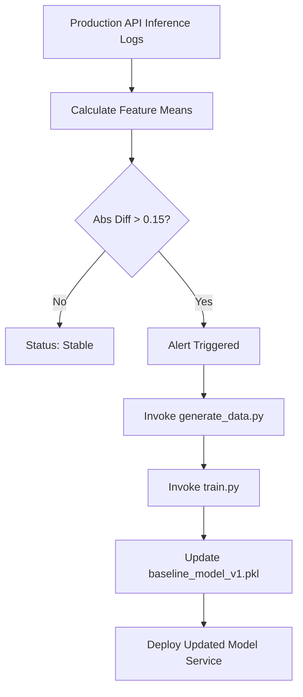

# 📄 Monitoring Documentation — Review III

## 1. Drift Detection Framework
Model monitoring is implemented in [ml/monitor.py](file:///d:/Class%2012/MLOPS%20Project/ml/monitor.py).

* **Detection Algorithm**: Statistical mean distribution comparison across recent 1,000 production inference requests.
* **Target Feature**: `demand_index`
* **Threshold Criteria**:
  $$\text{Drift Detected IF } |\bar{x}_{\text{recent}} - \mu_{\text{baseline}}| > 0.15$$

## 2. Performance Monitoring & Retraining Workflow

